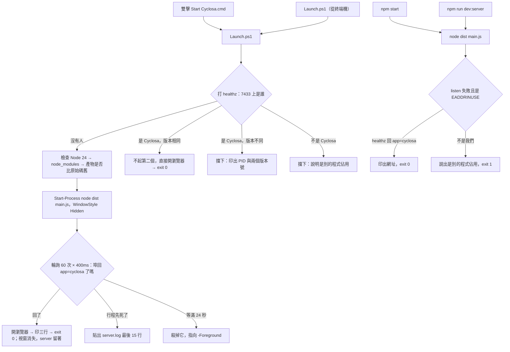
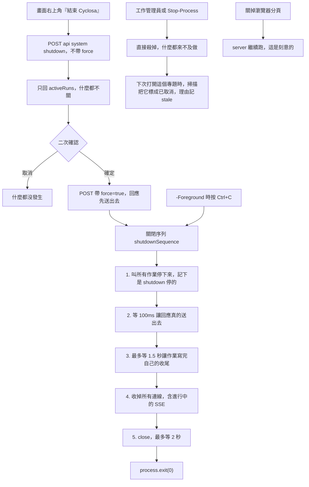

# 應用程式生命週期 —— 啟動、單一實例、關閉

**這一份是「這個程式怎麼開起來、怎麼結束」的權威。** 資料怎麼流見
[`walkthrough.md`](walkthrough.md)，程式怎麼分層見 [`overview.md`](overview.md)。

> **為什麼要有這一份。**
>
> 生命週期原本散在四個地方：ADR-0020（埠與單一實例）、ADR-0025（啟動器退場）、
> `README.md` 的指令表、`Launch.ps1` 的註解。**四份各自都對，而沒有人畫過那條線。**
>
> 2026-09-10 檢視這條線的時候找到三個缺口，其中兩個是真的壞的 ——
> 而它們都落在「兩份文件的交界處」：一個在「結束」與「SSE 進度通道」之間，
> 一個在「結束」與「Run 狀態機」之間。**沒有一份文件的範圍涵蓋那兩個交界。**

## 五條啟動路徑

| 路徑 | 埠被佔用時 | 版本比對 | 寫 `server.log` | 開瀏覽器 |
|---|---|:--:|:--:|:--:|
| 雙擊 `Start Cyclosa.cmd` | 開既有的 | ✅ | ✅ | ✅ |
| `.\Launch.ps1`（終端機） | 開既有的 | ✅ | ✅ | ✅ |
| `.\Launch.ps1 -Foreground` | 開既有的 | ✅ | ❌（直接印在視窗裡） | ❌（刻意） |
| `npm start` | **印一句話並 exit 0** | ❌ | ❌ | ❌ |
| `npm run dev:server` ＋ `npm run dev` | **印一句話並 exit 0** | ❌ | ❌ | ❌ |

**「已經在跑了」的判斷在兩個地方，而那不是重複。** `Launch.ps1` 那一份要在
**啟動之前**就決定要不要開瀏覽器；`main.ts` 那一份是在 `listen` 失敗之後
才問「7433 上的是不是我們自己」。少了後者，`npm start` 撞到埠得到的是
一段 `EADDRINUSE` 堆疊 —— 而使用者想做的事（把 Cyclosa 打開）完全合理。

> **位置比機制重要。** `tagcor-ledger` 的單一實例守門在 `main.py` 裡而不是
> 啟動器裡，所以不管你怎麼啟動它都成立。這裡 2026-09-10 補的就是那個位置。

## 啟動

三件事值得單獨記住：

- **`/healthz` 一定要看 `app` 欄位。** 只看「有沒有回 200」會把別人跑在 7433 的服務
  誤認成自己，然後把瀏覽器開到一個不相干的網頁（ADR-0020）。
- **還要看版本。** 一個舊版的 Cyclosa 還在 7433 上時，「已經在執行中，直接開瀏覽器」
  會把使用者送去看舊的程式，而畫面上沒有任何地方說得出這件事（2026-09-07 實際踩到）。
- **等的是「埠真的回應了」，不是固定秒數。**

## 關閉

**第 3 步等不到不是錯誤。** 正在抓的那一項會做完，而一次抓取本來就要等
≥3 秒的節流 —— 等不到的那些由**下一次打開這個專題時的孤兒掃描**接住。
兩層合起來才蓋得住全部：第一層管正常關閉，第二層管當掉與工作管理員。

**第 4 步是整條序列的關鍵。** Fastify 的 `forceCloseConnections` 預設是
`'idle'` —— 收得掉閒置連線，**收不掉進行中的請求**，而進度通道正是一條
進行中的請求（`reply.hijack()`）。少了這一步，「正在看一個執行中的作業」
的時候按結束，`close()` 永遠不 resolve，掛在它後面的 `exit` 也就永遠不跑。

**關掉分頁不等於關掉程式**，這是決定不是疏漏：可能開了兩個分頁，也可能是誤關，
而 `beforeunload` 本來就不保證送得出去（ADR-0025）。

**二次確認的門在伺服器端**，不是在畫面上 —— 只做在前端的話它就是一個繞得過的提醒，
而這顆按鈕會讓正在跑的抓取中斷。

## 這條線上曾經有三個缺口（2026-09-10 修）

留在這裡是因為**它們解釋了為什麼序列長這樣**，而且三個都不像 bug。

### 一、有 SSE 連線開著時，`app.close()` 不會 resolve

用本專案自己的 fastify 實測，兩個對照：

| 情形 | `app.close()` |
|---|---|
| 閒置的 keep-alive 連線 | 1 ms resolve |
| 開著的 hijack SSE | **3000 ms 還沒 resolve** |

於是 `.then(() => process.exit(0))` 永遠不會跑，而畫面已經顯示
「Cyclosa 已經關掉了」。**這正是二次確認那個對話框在講的情境**（有 N 個作業在跑）。

**測試抓不到是有原因的**：`app.inject` 不開真的 socket，而 `force: true`
那條路一條測試都沒有 —— 它會 `process.exit`。修法是把序列抽成一個不碰
process 的函式（`interface/http/shutdown.ts`），並用**真的連線**測它一次
（`tests/interface/shutdown-sequence.test.ts`，拿掉第 4 步會紅）。

### 二、被關掉的作業永遠停在「執行中」

關閉不碰 run registry，資料庫裡那一列還是 `running`。兩個症狀：

- 作業紀錄那顆徽章永遠寫「執行中」，而且**沒有取消鍵**
  （按鈕綁 `run.live`，而 `live` 是記憶體算的、重啟後是 false）
- `hasRunningRun()` 讓**之後每一次搜尋**都掛一句「有作業還在跑，這次的結果可能不完整」

修法是兩層（關閉時取消 ＋ 開專題時掃孤兒）加一欄 `run.ended_reason`
（schema v8）。**掃描只掃 `執行中`** —— 第一版連 `排隊中` 一起掃，
而擴展的「排隊」的意思是「在等你勾」，一條既有的 e2e 當場擋下來了。

### 三、五條啟動路徑只有一條擋得住第二個實例

判斷「已經在跑」的依據只在 `Launch.ps1` 裡，`npm start` 撞埠得到的是
Node 的 `EADDRINUSE` 堆疊 —— 而公開之後那是別人最可能打的指令。

**三個缺口有一個共同點**：它們都落在兩份文件的交界處。生命週期原本散在
ADR-0020、ADR-0025、README 的指令表與 `Launch.ps1` 的註解裡，
四份各自都對，而**沒有一份的範圍涵蓋「結束」與「進度通道」的交界，
也沒有一份涵蓋「結束」與「Run 狀態機」的交界**。這份文件就是那個範圍。

## CONVENTIONS §16 的五個問題

<!-- lifecycle:answers -->

| # | 問題 | 這個程式的答案 |
|---|---|---|
| 1 | 第二次啟動要做什麼 | 把既有的那個給他：`Launch.ps1` 直接開瀏覽器到 7433；`npm start` 印出網址並 exit 0。兩邊都先看 `/healthz` 的 `app` 與版本，不只看 200 |
| 2 | 「已經在跑」的判斷放哪 | 在 server 裡：`main.ts` 的 `listen` 撞到 `EADDRINUSE` 之後問 7433 上是不是自己。`Launch.ps1` 那一份是**另外**為了「啟動前就決定要不要開瀏覽器」，不是替代 |
| 3 | 啟動器憑什麼退場 | 輪詢 `/healthz` 直到回 `app=cyclosa`（60 × 400ms 是上限，不是等待時間）；行程先死就貼 `server.log` |
| 4 | 使用者關掉畫面之後，行程有沒有真的結束 | **沒有** —— 關掉分頁 server 還在，這是刻意的。所以畫面右上角有「結束 Cyclosa」，門在 server 的 `POST /api/system/shutdown`，有作業在跑時二次確認 |
| 5 | 結束時進行中的工作變成哪個狀態 | `已取消`，`ended_reason` 記 `shutdown`（正常關閉先取消）或 `stale`（下次打開專題時掃孤兒接住被殺掉的那一次）。不新增第七個狀態 |

**這張表是驗證器認得的**：有根層 `.cmd` 的專案缺這一份、或缺上面那個標記，
`D:\Projects` 會報 `lifecycle-answers-missing`（info）。表裡的內容機器不驗 ——
五個問題問的是設計意圖，機器只認得「有沒有寫」。

## 規則在哪

| 問題 | 權威 |
|---|---|
| 為什麼是固定埠 7433、為什麼埠被佔用要開既有的那一個 | [ADR-0020](../decisions/ADR-0020-port-and-single-instance.md) |
| 為什麼啟動器做完就退場、為什麼 server 起在隱藏主控台 | [ADR-0025](../decisions/ADR-0025-launcher-exits.md) |
| Run 的狀態與轉移 | [`state-machines.md`](state-machines.md) |
| `/healthz` 與 `/api/system/shutdown` 的形狀 | [`api-contract.md`](api-contract.md) |
| `server.log` 為什麼放在 `%LOCALAPPDATA%` 而不是資料根 | [ADR-0025](../decisions/ADR-0025-launcher-exits.md) |
