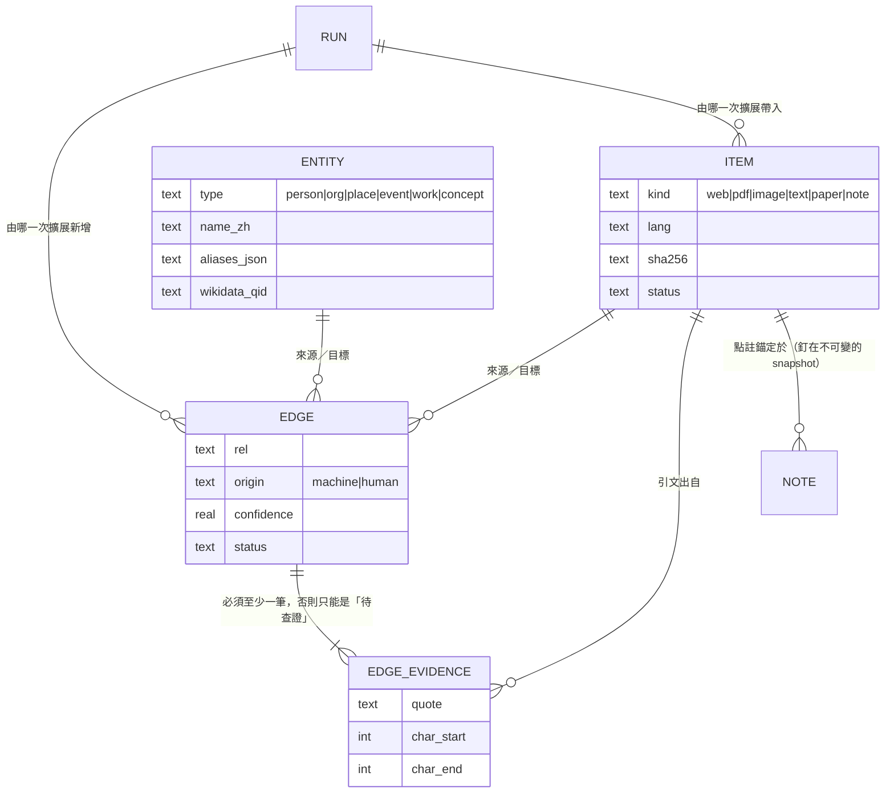

# 資料模型

**這份是表、欄位、值域、索引與資料模型決定的權威。** 查詢怎麼寫、UI 怎麼顯示
不寫在這裡；狀態轉移在 `state-machines.md`。

> **現況：設計，尚未實作。** 沒有 migration、沒有資料庫、沒有 schema 版本。
> 下面的欄位名是**規劃**，第一次寫 migration 時要回來把這份改成現況。

---

## 圖模型

## 為什麼是「雙層」而不是把實體畫在線上

一個被 *n* 份文件提到的實體，**當節點**要 *n* 條邊，**當邊上的標籤**要
*n(n−1)/2* 條邊。**交叉點在 n=3**：三份文件以上的共同實體，畫成節點反而比較少線。

所以：**儲存永遠是雙層（bipartite）**，而「要不要把實體攤平成文件之間的連線」
是**每一個畫面各自算的投影**，預設門檻 3。這是顯示層的決定，不進資料庫。

## 表

| 表 | 存什麼 | 關鍵約束 |
|---|---|---|
| `case` | 專題本身 | 一個專題一個 SQLite 檔，這張表在檔內只有一列 |
| `item` | 資料節點 | `sha256` 對應不可變的 snapshot；`status` 見狀態機 |
| `entity` | 實體節點 | `aliases_json` 存 `[{name, lang, script}]`；`wikidata_qid` 選填 |
| `edge` | 關聯 | `origin`（`machine`／`human`）與 `status` **分開存** |
| `edge_evidence` | 引文 | `quote` ＋ `char_start` ＋ `char_end`，指向某個 `item` |
| `note` | 筆記與點註 | 錨點用 W3C 選擇器，**釘在 snapshot 上** |
| `run` | 一次擴展作業 | 每個新增的 `item`／`edge` 都記得自己來自哪一次 |

## 四個會被違反的約束

1. **`edge.status='已確認'` 需要至少一筆 `edge_evidence`**，除非 `origin='human'`。
   由資料庫層守，不是靠 UI 記得。
2. **`origin='human'` 的列只能新增不能改。** 機器永遠不得覆寫人工判定。
3. **`item.sha256` 對應的 snapshot 不可變。** 重跑抽取產生的是新的衍生物，
   不動 snapshot —— 所以點註不會因為抽取演算法改版而漂掉。
4. **`item.lang` 偵測不出來記 `und`，不猜。**

## 中文檢索：自建 bigram，不用 FTS5 的 `trigram`

**實測（2026-09-05，Node v24.15.0 帶 SQLite 3.51.3）**：對同一列中文內容，
`trigram` tokenizer 的 **2 個字查詢命中 0 列**，3 個字命中 1 列。

那是 `trigram` 的設計（少於 3 個 unicode 字元不 match），不是 bug ——
但中文查詢多半是 2 字詞（「疫情」「台積」）。**所以中文走應用層自建的 bigram 索引**，
拉丁／西里爾等走 FTS5 `unicode61`，依 `item.lang` 選路。

## 向量：第一版不引 `sqlite-vec`

BLOB 存向量、`Float32Array` 純 JS 暴力比對。**超過 5 萬筆才重新評估。**
理由是 `sqlite-vec` 是原生擴充，與「零原生模組、一鍵啟動」衝突。

## 排序與 collation

`node:sqlite` **沒有 `createCollation`**（`db.function()` 有，collation 沒有），
而 JS 也產不出可存進 SQL 的 collation sort key。中文標題排序要自己維護
`title_rank` 索引欄位，內容變動後用 `Intl.Collator('zh-Hant')` 重排。

> 這一條是從 `rubricator` 借來的 —— 它踩過同一個坑，寫在它的
> `docs/environment/versions.md`。兩個專案都用 `node:sqlite`，同一個限制。

## 翻譯是衍生物，永不覆蓋原文

圖上外語節點顯示「繁中標題（原文標題）」，原文一鍵可切回，
翻譯要標記來源模型與時間。**不自建跨語言對照表** ——
實體對齊靠 LLM 判定（要出處）與選填的 Wikidata QID 當權威錨點。
