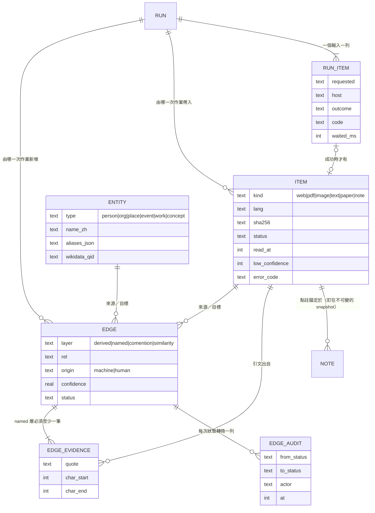

# 資料模型

**這份是表、欄位、值域、索引與資料模型決定的權威。** 查詢怎麼寫、UI 怎麼顯示
不寫在這裡；狀態轉移在 `state-machines.md`。

> **現況：`schema v5`，已實作。**
> 正本是 `src/infrastructure/db/migrations/`（`001-initial.sql`、`002-ingest.sql`、
> `003-adjudication.sql`、`004-expansion.sql`、`005-annotation.sql`），
> 版本號記在 `PRAGMA user_version`。**改那裡就要改這一份，反過來也一樣。**
>
> - **v1（2026-09-07，Stage 5）**：11 張表、18 個索引、3 條 trigger。
> - **v2（2026-09-07，Stage 6）**：`item` 補 11 欄、`run` 補 3 欄、
>   **新增 `run_item`**。理由見下面。
> - **v3（2026-09-08，Stage 8）**：**沒有新欄位也沒有新表** ——
>   `edge`／`edge_evidence`／`edge_audit` 在 v1 就建好了。
>   加的是**四條 trigger 與兩個索引**，而它們全部來自
>   「真的動手寫寫入路徑」那一天才看得到的東西。
> - **v4（2026-09-08，Stage 9）**：`run` 補 4 欄、**新增 `run_angle`**、
>   一條 trigger 與一個索引。全部繞著同一句話：**擴展不是黑箱** ——
>   勾了哪幾條、沒勾哪幾條、花了幾次呼叫、多少錢，都要留下來。
> - **v5（2026-09-08，Stage 10）**：`note` 補 **一欄**、一條 trigger、一個索引。
>   `note` 那張表 v1 就在了 —— 這一版加的是**兩條之前只寫在註解裡的規則**：
>   點註錨的是**哪一份快照**（`snapshot_sha256`），
>   以及**一則點註在圖上就是一個 `kind='note'` 的 `item`，兩者同一個 id**。
>   第二條之前只存在於 `domain/ingest/state.ts` 的一段註解裡，而**註解攔不住 INSERT**。
>
> **升級既有資料庫之前會先用 `VACUUM INTO` 留一份複本到 `<資料根>\backups\`**，
> 而且**備份失敗就不 migrate** —— 沒有退路的 migration 是這個專案不該自己製造的風險。
> 用 `VACUUM INTO` 而不是複製檔案：WAL 模式下 `.sqlite` 那一個檔案
> **不包含還在 `-wal` 裡的交易**。
>
> **2026-09-06 大改**：`edge.layer`、`edge_audit`、`item.read_at`、墓碑索引、
> 向量的 `model`／`dim`、投影三段 —— 全部來自 2026-09-05 的設計稿與那次的市場調查。

---

## 圖模型

## 為什麼是「雙層」而不是把實體畫在線上

一個被 *n* 份文件提到的實體，**當節點**要 *n* 條邊，**當邊上的標籤**要
*n(n−1)/2* 條邊（那 *n* 份兩兩相連）。**交叉點在 n=3**。

設計稿實際模擬過 **500 篇／250 個實體／每篇 5 個**：

| | 線數 |
|---|---|
| 全部當節點 | **2,500** |
| 全部標在線上 | **33,949** ← 13.6 倍 |

還有一件更根本的：*n* 份共用一個實體，畫成線是一個 *n* 點的完全圖 ——
**那麼多條線只帶 1 bit 的資訊**（「這 n 篇共用 X」）。當成一個節點，
同樣 1 bit 只花 *n* 條線，**而且看得出來共用的是「誰」**。

**所以儲存永遠是雙層（bipartite）**，投影只在當下這一屏算 ——
資料庫不會被平方級的邊撐爆。

### 投影分三段，門檻都可調、都不進資料庫

| 被幾份文件提到 | 怎麼畫 |
|---|---|
| **1 份** | **純屬性，根本不畫** —— 一個只出現過一次的實體對圖沒有貢獻，它只是那份文件的屬性 |
| **≤2 份** | **投影成線**，線中點放一個方塊，方塊就是那個實體（`layer='comention'`）|
| **≥3 份** | **展開成空心節點** |

**這三個門檻是顯示層的決定，改它們不需要 migration。**
`open-questions.md` Q1 記著「門檻 3 是算出來的但沒實測過」——
做成可調正是回答那個問題的方式。

## 表

| 表 | 存什麼 | 關鍵約束 |
|---|---|---|
| `case` | 專題本身 | 一個專題一個 SQLite 檔，這張表在檔內只有一列 |
| `item` | 資料節點 | `sha256` 對應不可變的 snapshot；`status` 見狀態機；`read_at` 是正交旗標 |
| `entity` | 實體節點 | `aliases_json` 存 `[{name, lang, script}]`；`wikidata_qid` 選填 |
| `edge` | 關聯 | `layer` 決定它走不走裁決；`origin` 與 `status` **分開存** |
| `edge_evidence` | 引文 | `quote` ＋ `char_start` ＋ `char_end`，指向某個 `item` |
| **`edge_audit`** | **狀態轉換的稽核** | **只增不刪**。校準比例的資料來源 |
| `note` | 筆記與點註 | 錨點用 W3C 選擇器，**釘在 snapshot 上**（`snapshot_sha256`）；**`id` 同時是它那個 `kind='note'` 的 `item` 的 id** |
| `run` | 一次擴展或匯入作業 | 每個新增的 `item`／`edge` 都記得自己來自哪一次 |
| **`run_item`** | **一次作業裡的一個輸入** | **一個輸入不一定會變成一個 `item`** —— 見下面 |
| **`run_angle`** | **一次擴展的切入角度** | **沒被勾的那幾條也留著** —— 見下面 |
| `vector` | 向量 | **必記 `model` ＋ `dim`** —— 見下面 |
| `bigram` | 中文檢索索引 | 應用層自建，見下面 |

## 為什麼 `run_item` 不能用 `item` 代替

一次匯入的**輸入**與它產生的**節點**不是一對一：

| 輸入的結果 | 有沒有 `item` |
|---|---|
| 抓到而且抽得出正文 | 有 |
| 404／逾時／抓到但抽不出東西 | **有**（`status='failed'`，可以重試）|
| `robots.txt` 不准 | **有**（同上，記著原因）|
| **內容已經在專題裡了**（SHA-256 相同）| **沒有** —— 指向既有的那一個 |
| 貼進來的不是網址 | **沒有** |
| 整批被取消，還沒輪到它 | **沒有** |

作業紀錄那一頁**必須看得到後面三種**，否則「40 個 URL 有 3 個沒進來」
這句話裡的 3 就沒有地方顯示原因。所以 `run_item` 是「一個輸入的一生」，
`item` 是「一個節點的一生」，兩者只有在成功時重合。

`run_item` 的欄位直接對應 ui-workflows 的那張表：
狀態／來源／網域／新增節點／新增關聯／備註，另外多一個 **`waited_ms`** ——
那是「同網域間隔 ≥ 3 秒」這條驗收條件**量得到的地方**（REQ-0003）。

## `run_angle`：沒被勾的那幾條也留著

一次擴展分兩階段：`POST /runs` 產生角度（**還沒開始抓**），
使用者勾選之後 `POST /runs/:id/angles` 才真的開始。這張表就是那兩階段之間的東西。

| 欄 | 存什麼 |
|---|---|
| `ord` | 顯示順序 ＝ 模型給的順序。**不重排** —— 重排會讓「第幾條」在兩個畫面上不一樣 |
| `question` ／ `stance` | 子問題與它的立場標籤 |
| **`seeds_json`** | **這條角度是從專題裡既有的哪幾份長出來的**（`item.id` 陣列）|
| `selected` | 使用者有沒有勾它 |
| `found_urls` ／ `new_nodes` ／ `new_edges` ／ `code` | 這條角度自己的收尾。**一條失敗不影響其餘** |

**沒被勾的那幾條留著而且留成「沒被勾」。**
「工具提了六條、你只要兩條」是這次作業發生過的事實的一部分 ——
只存勾到的，作業紀錄就變成一份看不出當時有哪些選項的紀錄。

> ### `seeds_json` 是設計稿那一欄的替代品，而那是刻意的
>
> 2026-09-05 的設計稿在每條子問題上寫「問題 · 立場標籤 · **預估會找到幾個**」。
> 那個數字只可能有一個來源 —— **叫模型猜一個** ——
> 而它會以一個精確的樣子出現在一個要人做決定的畫面上。
> 這跟「可信度不給小數」（ADR-0017）擋的是同一件事。
>
> `seeds` 換掉它：**「依據你已有的 3 份」是我們查得到、也驗得了的**
> （模型回的是編號，而編號一律驗證，對不上的丟掉）。
> 而且它對「要不要勾這一條」更有用 —— 它說的是這條角度憑什麼被提出來。
> 完整理由在 ADR-0021。

## `run` 對擴展多的四欄

| 欄 | 為什麼要存 |
|---|---|
| `topic` | 匯入沒有主題，所以可以是 NULL —— **兩種 run 共用一張表** |
| `providers_json` | 用了哪些模型。**換一個模型重跑結果會不一樣**，而沒有這一欄的話兩次結果不同時沒有任何地方查得出「換了模型」 |
| `requests` | 實際打了幾次。**請求數是主要上限**（ADR-0006 的補記）|
| `cost_usd` | provider 回報的實際金額 |

> **`cost_usd` 的 `NULL` 與 `0` 是兩件事，而且這一欄是它們唯一分得開的地方。**
> 本機模型的金額成本真的是 0；一個沒回報成本的雲端 provider 是「不知道」。
> 兩者都寫成 0 的話，畫面上那句「已花費 $0.00」對前者是事實、對後者是謊。
> **不估算** —— provider 沒給就是 NULL。

## `item` 的兩個 URL 欄位

| 欄位 | 存什麼 |
|---|---|
| `requested_url` | **使用者實際貼進來的那一個。** 唯一索引，所以同一個 URL 不會建第二個節點 |
| `source_url` | 轉址跟完之後**真正抓到的位址** |

只留一個的話，短網址與轉址會讓同一份東西進來兩次 ——
使用者下次再貼一次的是前者，而我們抓到的是後者。

**內容層的去重另外靠 `sha256` 的唯一索引**：兩個不同的 URL 給出同一份位元組時，
第二個不建節點，作業紀錄記一列 `FETCH_DUPLICATE`（notice，**不是失敗**）。

## 關聯分四層（ADR-0015）

`edge.layer` 的四個值決定它**要不要人裁決**與**怎麼畫**：

| `layer` | 是什麼 | 進裁決佇列 | 產生方式 |
|---|---|:--:|---|
| `derived` | 轉載、翻譯、鏡像 | **否** | 機器可驗（雜湊／URL／重疊率），**可重算** |
| `named` | 世界上的主張 | **是** | LLM 抽取，要引文 |
| `comention` | 實體投影出來的線 | 否 | 投影，**可重算** |
| `similarity` | 算出來的分數 | 否 | 向量比對，**可重算** |

**只有 `named` 走 `state-machines.md` 的那個狀態機。** 另外三層是計算結果 ——
把可驗證的東西送去人工裁決，會讓人開始不看內容就按確認。

### `item` 與 `entity` 之間那條「提到」的邊算哪一層

**算 `comention`。** 這一條在 Stage 7 之前沒有寫下來，
而**投影是第一個非知道不可的東西**（2026-09-07 補）。

儲存永遠是雙層的（見上面），所以「A 這篇提到 X 這個人」是一條
`item → entity` 的邊。它機器可重算、不進裁決佇列 —— 這兩點跟 `comention` 一致。

**但它在畫面上有兩種長相**，而那是同一層的兩種投影結果：

| 那個實體 | 那條邊怎麼畫 |
|---|---|
| 被 ≥ 3 篇提到（展開成節點）| **一條普通的等寬線**，連到那個空心節點 |
| 被 2 篇提到（攤平）| 那條邊不畫；改畫一條 `item—item` 的線，**線中點的方塊就是那個實體** |
| 只被 1 篇提到 | **不畫** |

兩種都畫成「線中點放方塊」的話，**同一個實體會在畫面上出現兩次** ——
一次是線末端的空心節點，一次是線中間的方塊。
那是 Stage 7 第一次截圖時的實際長相，而它看起來像圖上多了一堆意義不明的小方塊。

### 非 `named` 的邊，`status` 欄沒有意義

`edge.status` 是 `NOT NULL`，而機器建立的邊在沒有出處之前只能是 `pending`
（trigger 擋著，見下面的約束 1）。所以 `comention`／`similarity`／`derived`
的那一欄**一律是 `pending`，而那個值不代表「等你查證」**。

**顯示層據此把查證狀態的畫法只套在 `named` 上** ——
否則圖上會佈滿永遠不會消失的琥珀虛線，而真正在等人判斷的那些就淹沒在裡面了。

> **2026-09-08（Stage 8）：這一條從觀察變成約束。**（原 open-questions Q6）
>
> **沒有加第四個「不適用」的值。** 兩個理由：
> `DEFAULT_FILTERS.statuses` 是 `['pending','confirmed']`，多一個值會讓
> **全部的共同提及與相似度線在預設篩選下整批消失** ——
> 那是一個沒有人會想到要去改篩選才能解釋的空畫面；
> 而且那件事**已經從 `layer` 推得出來**，同一個事實存兩個地方遲早有一個是錯的。
>
> 改成把「不適用」變成一條約束（約束 7）：**機器建的非 `named` 邊只能是 `pending`**。
> 於是那一欄在那些列上永遠是同一個值 —— **它不帶資訊，也就不會誤導**。
>
> 「能不能裁決」是另一件事，判準是**「這條邊會不會被重算蓋掉」**
> 而不是層別 —— 規則與那張表在 `state-machines.md`。
>
> **顯示層跟著同一條規則**：那個值沒有意義的地方就不顯示它
> （`domain/graph/render-rules.ts` 的 `edgePanelFieldsFor`）。
> 2026-09-08 的人工驗收照出反例：一條共同提及線的面板標題旁寫著「待查證」，
> 而正下方寫著「沒有確認與否決」—— **同一屏上兩句話互相矛盾**。

### 獨立來源數：即時算，不存

把一條邊的 `edge_evidence` 依「它們的 `item` 之間有沒有 `derived` 關係」分群，
**每一群算一個獨立來源**。UI 顯示「出處 5 筆 · 2 個獨立來源」。

**不存起來**：它會隨新的 `derived` 邊出現而改變，
**存起來的那一刻就開始過期，而過期的可信度比沒有可信度糟**。

## 九個會被違反的約束

1. **`edge.status='已確認'` 需要至少一筆 `edge_evidence`**，除非 `origin='human'`。
   由資料庫層守，不是靠 UI 記得。
2. **`origin='human'` 的列只能新增不能改。** 機器永遠不得覆寫人工判定。
3. **`item.sha256` 對應的 snapshot 不可變。** 重跑抽取產生的是新的衍生物，
   不動 snapshot —— 所以點註不會因為抽取演算法改版而漂掉。
4. **`item.lang` 偵測不出來記 `und`，不猜。**
   而 2026-09-07 的量測發現 **`franc` 判不出來的時候不會說判不出來** ——
   69 個字的英文頁被判成法文。所以偵測外面有兩道**用證據推翻標籤**的閘門
   （字數下限、CJK 比例與標籤矛盾），**兩道都只把答案推向 `und`**。
   細節在 `multilingual.md`。
5. **墓碑**：`(source, target, rel)` 被否決過的組合，機器不得再提為 `待查證`
   （例外見 ADR-0016）。**需要 `(source, target, rel)` 的索引** ——
   這是擴展寫入路徑上每一條候選邊都要查一次的東西。
6. **向量的 `model` 不符就拒絕比對**，不是回一個看起來正常的數字。見下面。
7. **機器建的非 `named` 邊只能是 `pending`**（v3）。
   `origin='human'` 不受這一條限制 —— 人手動建一條「轉載」時它就是 `已確認`。
   **規則裡有 `origin`，不只有 `layer`。**
8. **`edge_audit` 只增不刪**（v3）。校準比例是從它算出來的，
   **一列被改掉的紀錄會讓那個百分比安靜地變成另一個數字**，
   而使用者沒有任何辦法發現。唯一的例外是邊自己被刪掉時的 `ON DELETE CASCADE` ——
   trigger 的 `WHEN` 子句用「那條邊還在不在」分辨這兩件事。
9. **長度為 0 的引文不是出處**（v4）。v1 的 CHECK 是 `char_end >= char_start`，
   所以 `(0, 0)` 過得去 —— 而那一列在畫面上會顯示成一筆出處、點下去跳到一個空區間。
   更糟的是它**會讓一條邊變成可以被確認的**：
   `trg_edge_confirm_requires_evidence_*` 數的是列數，不是內容。

   > 這一條是 Stage 9 才需要的，因為 Stage 9 是第一次有東西
   > **拿模型給的數字去填那兩欄**。答案是不填 —— 位置自己找（ADR-0021）——
   > 而這條 trigger 是那個決定在資料庫層的備援。

## `named` 邊的 `confidence` 是從出處數出來的

**存的一直是連續分數**，而那個分數的來源在 Stage 9 才確定下來：
`domain/graph/confidence.ts` 的 `scoreFor`，只吃**獨立來源數**與**有沒有直接引文**。

| 獨立來源 | 分數 | 等級 |
|:--:|:--:|:--:|
| 1 | 0.3 | 弱 |
| 2 | 0.5 | 中 |
| 3 | 0.7 | **強** |
| 4 | 0.9 | 強 |

上限 0.95 —— **1 保留給 `origin='human'`**（那個 1 是為了線寬，不是量出來的）。

**重算的時機是「這條邊的出處變了」，不是「有人提了一個新分數」**
（`recomputeConfidence`）。每一次提案都是「一份文件、一句引文」，
所以提案帶來的分數永遠一樣 —— 拿它比大小的話，第二個、第三個獨立來源
永遠不會讓分數動，而那正是這個分數唯一在說的事。

**其餘三層不走這一支**：`comention` 是骨架、`derived` 是機器可驗、
`similarity` 是相似度本身 —— 它們的分數不是從出處來的，照這支重算會全部歸零。

## `item` 的抽取欄位：每一個都有一個畫面在讀它

不是為了完整而存的中繼資料 —— **沒有畫面在讀的欄位不要加**。

| 欄位 | 誰在讀它 |
|---|---|
| `low_confidence` ＋ `low_confidence_reasons` | 清單的標記與閱讀器的說明。**理由是使用者唯一能據以判斷的東西** |
| `mime` ＋ `source_ext` | `sources/<sha256>.<ext>` 要靠 `ext` 才找得到檔案 |
| `byte_size` | 專題清單的「快照佔用」 |
| `excerpt` | 清單與檢索結果的摘要 |
| `extractor_version` | 整批重算時認出哪些 `derived/` 過期了 |
| `page_count` | 閱讀器的頁碼導覽（PDF，**1-based**）|
| `image_width` ／ `image_height` | **矩形註記的座標系**（ADR-0019 的 `#xywh=pixel:`）。讀不出來就是 `NULL`，不猜 |
| `error_code` | 失敗的那一項自己的碼。**不是一個「匯入失敗」** |

## 向量：BLOB ＋ 純 JS 比對，但必須記住是誰產的

第一版用 BLOB 存向量、`Float32Array` 純 JS 暴力比對。**超過 5 萬筆才重新評估**
（ADR-0009；理由是 `sqlite-vec` 是原生擴充，與「零原生模組、一鍵啟動」衝突）。

**`vector` 表必須有 `model`、`dim`、`created_at` 三欄，而且查詢時模型不符要拒絕。**

> ### 為什麼這一條是硬約束
>
> LightRAG 的文件明寫（2026-09-06 實查，A 級）：嵌入模型**一旦選定就不能換**，
> 換了要把所有東西重新算一遍。
>
> 而危險的地方在於**它不會報錯** —— 兩個不同模型產生的向量，
> 餘弦相似度**照樣算得出一個數字**。使用者看到的是「搜尋結果變爛了」，
> 不是「模型換了，舊向量作廢」。
>
> **這是一個靜默失效，而這個專案對靜默失效的立場很明確**（見 `lessons.md`）。
> 所以：記下 `model` 與 `dim`，不符就**報錯**，並告訴使用者要重算。
>
> 第一版的模型是 **`bge-m3`（1024 維）**，走本機 Ollama。

## 中文檢索：自建 bigram，不用 FTS5 的 `trigram`

**實測（2026-09-05，Node v24.15.0 帶 SQLite 3.51.3）**：對同一列中文內容，
`trigram` tokenizer 的 **2 個字查詢命中 0 列**，3 個字命中 1 列。

那是 `trigram` 的設計（少於 3 個 unicode 字元不 match），不是 bug ——
但中文查詢多半是 2 字詞（「疫情」「台積」）。**所以中文走應用層自建的 bigram 索引**，
拉丁／西里爾等走 FTS5 `unicode61`，依 `item.lang` 選路；
**`und` 的內容兩條路都建索引**。

## 排序與 collation

`node:sqlite` **沒有 `createCollation`**（`db.function()` 有，collation 沒有），
而 JS 也產不出可存進 SQL 的 collation sort key。中文標題排序要自己維護
`title_rank` 索引欄位，內容變動後用 `Intl.Collator('zh-Hant')` 重排。

> 這一條是從 `rubricator` 借來的 —— 它踩過同一個坑，寫在它的
> `docs/environment/versions.md`。兩個專案都用 `node:sqlite`，同一個限制。

## 點註的錨點：一個欄位裝三種來源（ADR-0019）

`note.selector_json` 存 W3C Web Annotation 的**選擇器陣列**，型別由每個元素的
`type` 分。**不為三種來源開三張表** —— W3C 模型本身就是為這件事設計的。

| 來源 | 存哪些選擇器 |
|---|---|
| 網頁／Markdown／純文字 | `TextQuoteSelector` ＋ `TextPositionSelector` |
| **PDF** | 同上，但 `char_start`／`char_end` **相對於那一頁**，頁碼放在 `refinedBy` |
| **圖片** | `FragmentSelector`：`#xywh=pixel:x,y,w,h`（**`pixel:` 不是 `percent:`**）|

**PDF 的字元區間相對於頁而不是整份文件** —— 整份文件的位移會被前面任何一頁的
抽取差異推移，**一頁抽錯會讓後面每一頁全漂**。失敗要能被局部化。

### 一則點註是兩列，而它們同一個 id

| 表 | 那一列是什麼 |
|---|---|
| `item`（`kind='note'`）| **圖上的那個節點** —— 它才能參與關聯（ADR-0010 第 4 條）|
| `note` | 錨點：選擇器、標在哪一份（`item_id`）、標的是那一份的**哪一個快照** |

`edge.source_kind` 的值域只有 `item` 與 `entity` ——**沒有 `note`，而那不是漏掉**：
`item.kind` 從 v1 就收著 `'note'`，也就是一則點註**本來就是一個 `item`**，
只是它不走擷取管線（沒有快照、沒有 fetch、沒有 URL）。

**`note.id` 與 `note.item_id` 是兩個不同的東西**：前者是這則點註自己
（也是它在圖上那個節點的 id），後者是它標在哪一份上。
v5 的 `trg_note_needs_item_node` 守著「`note` 那一列進不去，除非同 id 的
`item` 已經在了而且 `kind='note'`」。

### `snapshot_sha256`：「錨在快照上」在 schema 上的對應物

ADR-0010 第 2 條寫著錨點釘在 `sources/` 的不可變快照上。
但在這一欄出現之前，**那句話在資料庫裡沒有任何痕跡** ——
一則點註只記得它屬於哪個 `item`，而一個 `item` 的快照是可以換的
（抓失敗之後重試，換到一份不同的內容，`sha256` 就變了）。

有了這一欄，「這則點註是對著哪一份東西標的」是一個**可以比對的事實**：
快照換了 → 錨點對的是舊的那一份 → **直接報找不到，不拿新的快照去解舊的錨點**。

### 解出來的位置**不存**

`anchor_ok` 存的是「上一次解得出來嗎」，而**解出來的字元區間不存**。
存了它就會有一份跟 `derived/` 不同步的副本，而
「`derived/` 整批重算前後，每個點註的解析結果差異必須為 0」那條驗收
就變成在驗自己的快取。

## 翻譯是衍生物，永不覆蓋原文

圖上外語節點顯示「繁中標題（原文標題）」，原文一鍵可切回，
翻譯要標記來源模型與時間。**不自建跨語言對照表** ——
實體對齊靠 LLM 判定（要出處）與選填的 Wikidata QID 當權威錨點。

## 實體型別的值域

`entity.type`：`person`／`org`／`place`／`event`／`work`／`concept`。

> **參考先例**：`alephdata/followthemoney`（MIT）有 70 個 schema，
> 而我們只取六個。**刻意收斂** —— 它是為投查記者的結構化資料設計的
> （`BankAccount`、`Passport`、`ContractAward`…），而這個工具的來源是一般文件。
>
> 型別不夠用的時候要加，但**加之前先問「使用者會用它來篩選嗎」** ——
> 一個沒有人拿來篩選的型別只是多一個要填的欄位。
