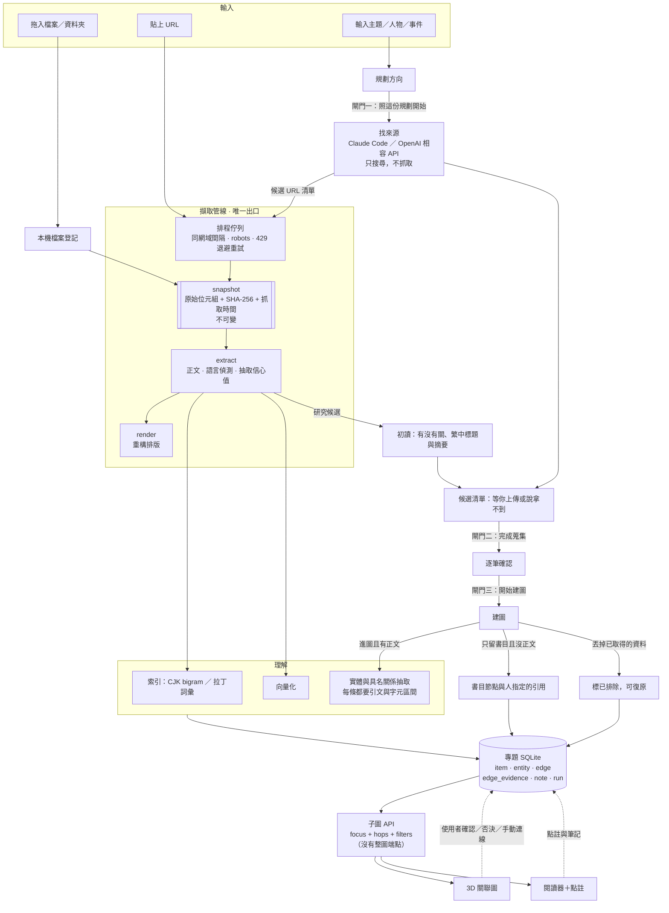
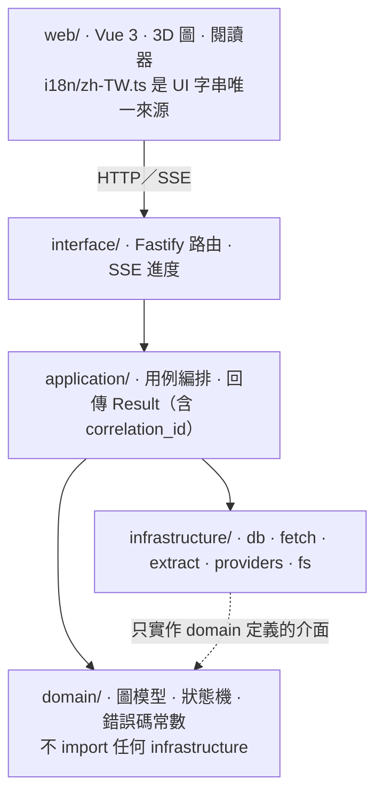

# 架構總覽

**這份是分層規則、擷取流程與檔案地圖的權威。** 欄位細節在 `data-model.md`，
狀態轉移在 `state-machines.md`，兩者都不要在這裡重複。

> **現況（2026-09-08）**：下面的檔案地圖**每一格都存在了**
> —— 除了 `domain/note/`，它實際上叫 `domain/annotation/`（v0.6.0 改的名，
> 因為它裝的是選擇器與錨點解析，不是「筆記」這個概念）。
> v0.8.0 另外加了 `domain/export/`。
>
> **一次完整流程的順序**（從匯入到匯出，以及每一步用不用模型）在
> `walkthrough.md`，不在這一份。
>
> 守門測試從 v0.1.0 起有四條，v0.3.0 加第五條（沒有整圖端點），
> v0.7.0 再加三條（版本號、schema 版本、i18n 純文字）—— **現在八條**。
> **每一條都注入過真實違規驗證它會紅。**

---

## 一次研究與建圖的運作流程（Stage 19–22，v0.25.0 出貨）



匯入本身不抽關聯，也不自動初讀；初讀只對研究候選執行。
已有正文的「只留著，不抽」保留原資料，不另建書目節點。

**這張圖只有一個要點：`agent` 找到的東西不能自己抓，一律回到 `FQ` 這個唯一出口。**
節流、robots、雜湊、manifest 只存在於那一層 —— 開第二條路等於讓它們全部失效。

## 分層與允許的匯入方向



三條最容易違反的：

- **`domain/` 零 I/O。** 不 import `node:fs`、`node:sqlite`，也不 import 其他層。
  它存在的理由就是讓真正會出錯的規則可以用純函式測試。
- **`domain/graph` 額外要求零依賴。** 它是 `rubricator` 已知的未來取用點 ——
  抽成套件的觸發條件寫在 ADR-0014：**兩邊的複本已經分岔，而那個分岔造成了一個 bug。**
  **現在不抽套件。**
- **業務規則不要寫進 route handler。** route 只做「解析請求 → 呼叫 service → 對映錯誤」。

## 檔案地圖

```
src/
├─ main.ts                建 server、掛路由、開資料庫、註冊 provider
├─ config/                設定載入、指標檔、預設值
├─ domain/                純邏輯，不 import infrastructure
│  ├─ case/               專題生命週期與狀態機
│  ├─ graph/              node／edge 型別、四層、可信度、邊的狀態機、
│  │                      墓碑比對鍵、出處規則、投影三段 ←【零依賴】
│  ├─ ingest/             擷取階段的狀態機與規則；節流與退避的數字（唯一宣告處）
│  ├─ annotation/         W3C 選擇器模型（TextQuote／TextPosition／Fragment）與錨點解析
│  ├─ text/               空白等價的比對與原文座標 ←【引文與點註共用同一支】
│  ├─ entity/             實體識別鍵、別名比對、合併建議
│  ├─ sources/            來源網站的可讀性判定（歷史優先）
│  ├─ export/             證據包的形狀與它的 Markdown／JSONL ←【純函式】
│  ├─ search/             查詢解析、bigram 切分、混合排序 ←【純函式】
│  ├─ provider/           能力宣告與任務需求的配對規則
│  └─ errors/             錯誤碼常數 ← error-codes.md 的單一真實來源
├─ application/           用例編排，一律回 Result{ok,code,correlationId}
├─ infrastructure/
│  ├─ db/                 node:sqlite、migrations/、repositories/
│  ├─ fetch/              節流器、限流時的退避重試、robots、快照寫入、manifest.jsonl
│  ├─ extract/            readability＋linkedom、pdfjs、語言偵測、抽取信心
│  ├─ index/              bigram 表寫入、FTS5、title_rank、向量 BLOB
│  ├─ providers/          agent/ chat/ embed/
│  └─ fs/                 資料根、指標檔、備份
├─ interface/http/ sse/
└─ shared/                Result、log、id、時間

web/src/
├─ views/                 專題清單／關聯圖／閱讀器／作業紀錄／設定
├─ components/graph/      GraphView.vue（包住 3d-force-graph）、圖例、篩選器、2D 切換
│                         objects.ts —— three.js 的幾何與材質工廠（顏色仍然只從 tokens.css 讀）
├─ components/reader/ notes/ common/
│                         graph/ExportPanel.vue —— 證據包匯出
├─ workers/layout.worker.ts
├─ stores/
├─ i18n/zh-TW.ts          **所有 UI 字串的唯一來源**
└─ styles/tokens.css      **顏色與記號的唯一來源**（ADR-0018）
```

> **`domain/search/` 是純函式，`infrastructure/index/` 才碰資料庫。**
> 分開的理由跟 `domain/graph` 一樣：查詢怎麼切 bigram、混合排序怎麼加權，
> 那些是會出錯而且值得用純函式測的規則；**寫進索引表**才是 I/O。

## 幾個刻意的選擇

| 選擇 | 為什麼 |
|---|---|
| **只提供子圖 API，沒有整圖端點** | 有了整圖端點，前端遲早會呼叫它，然後在 8k 節點時死掉 |
| **3D 用 `3d-force-graph`，包在自訂 `GraphView` 介面後面** | 換自寫渲染的觸發條件寫在 ADR-0007：**8k 節點時 fps 掉到 30 以下** |
| **佈局跑 Web Worker** | 力導向會吃滿主執行緒，圖會卡住 |
| **不引 `sqlite-vec`** | 原生擴充，與「零原生模組」衝突。第一版用 BLOB 存向量、`Float32Array` 純 JS 比對，超過 5 萬筆才重新評估 |
| **中文檢索自建 bigram，不用 FTS5 `trigram`** | `trigram` 少於 3 個 unicode 字元的查詢**不會 match 任何列**，而中文查詢多半是 2 字詞 |

## 錯誤處理

碼分組 `FETCH_*`／`PARSE_*`／`PROVIDER_*`／`GRAPH_*`／`CASE_*`／`IO_*`。
**UI 只顯示繁中訊息，碼只進日誌**；每次操作帶 `correlation_id`。

**絕不因為單一項目失敗讓整批失敗** —— `部分失敗` 是一等公民（見 `state-machines.md`）。
