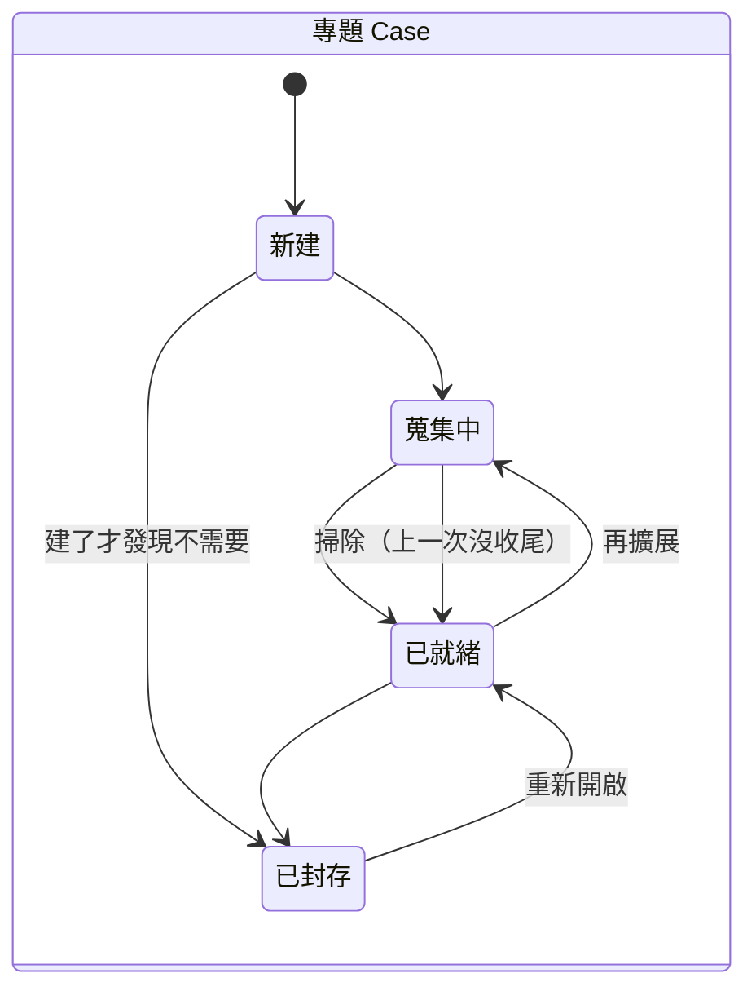
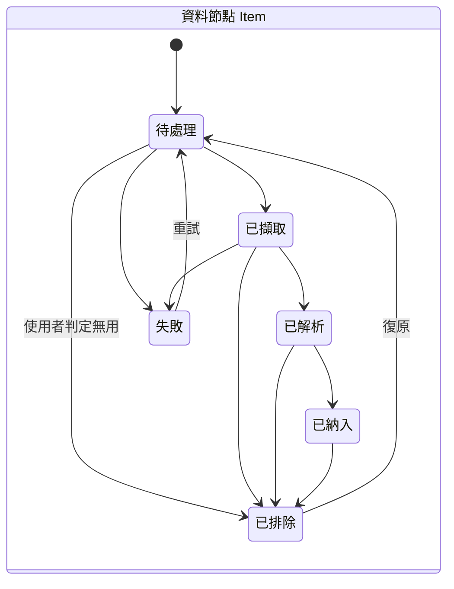
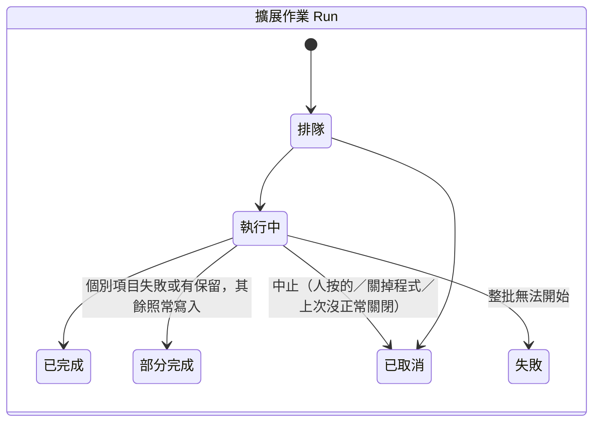
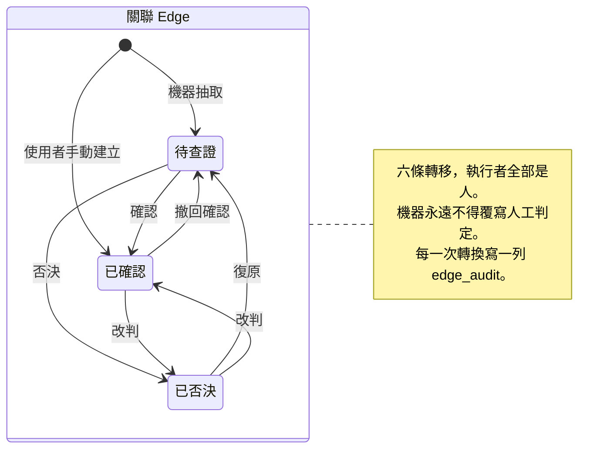

# 狀態機

**這份是每個狀態機「從 A 能不能到 B」的權威。** 觸發轉移的 UI 在哪一頁寫在
`ui-workflows.md`，不要在這裡重複。

> **圖是導覽，不是規格。** 下面每一節的**轉移表**才是權威 —— 圖回答不了
> 「從 A 能不能到 B」這個問題，但表可以。

> **現況（2026-09-07）**：`Case`、`Item`、`Run` 三個狀態機**已實作**
> （`src/domain/case/state.ts`、`src/domain/ingest/state.ts`），轉移表就是程式裡那幾張表。
> `Edge` 的六條轉移還只有純函式（`src/domain/graph/edge-state.ts`），
> 沒有寫入路徑 —— 那是 v0.4.0。

---

## 專題 Case

| 從 | 到 | 什麼時候 |
|---|---|---|
| （初始）| 新建 | 使用者建立專題 |
| 新建 | 蒐集中 | 第一次擴展或匯入開始 |
| **新建** | **已封存** | 使用者封存。**建了才發現不需要**（v0.17.0 補）|
| 蒐集中 | 已就緒 | 該批作業全部結束（含部分失敗）|
| **蒐集中** | **已就緒** | **掃除** —— 上一次沒有收尾就結束了（`run-sweep.ts`，v0.17.0 補）|
| 已就緒 | 蒐集中 | 再擴展 |
| 已就緒 | 已封存 | 使用者封存 |
| 已封存 | 已就緒 | 重新開啟 |

**沒有「刪除」狀態** —— 刪除就是刪除，不留狀態。
資料夾會被搬進 `backups\`，而**那個資料夾 app 永遠不讀**（storage-layout `backups\`）。

> ### 兩條在 v0.17.0 補上的線，以及它們為什麼漏了那麼久
>
> **`新建 → 已封存`**：原本只有 `已就緒 → 已封存`，於是一個建了才發現
> 不需要的專題**只剩下刪除這一條路**。這條線在封存第一次被接上按鈕的那天
> 才第一次被走到 —— 那支 API 從 v0.1.0 就在，而它**零個呼叫點**。
>
> **`蒐集中 → 已就緒`（掃除）**：狀態在作業開始時寫成 `蒐集中`、
> 結束時寫回 `已就緒`，而**兩邊都在行程裡**。行程沒機會跑完第二步就死掉，
> 那一列就永遠留在 `蒐集中` —— 而 `蒐集中` 封存不了。
> 也就是一個**永遠封存不了、也說不出為什麼**的專題。
>
> v0.14.0 的孤兒掃除修的是 `run.status`，**專題狀態是另一個欄位**；
> 更糟的是正常關閉會把作業寫成 `已取消`，於是掃除找不到東西可掃、直接早退 ——
> **那條修好的路反而繞過了這個修復。**
>
> 兩條的共同點：**沒有人呼叫過的轉移表裡沒有事實。**

## 資料節點 Item

| 從 | 到 | 什麼時候 |
|---|---|---|
| （初始）| 待處理 | 進入佇列 |
| 待處理 | 已擷取 | snapshot 寫好、雜湊算完 |
| 已擷取 | 已解析 | 正文抽出、語言判定、信心值記錄 |
| 已解析 | 已納入 | 進到圖裡 |
| 任何一個 | 已排除 | **使用者**判定無用 |
| 已排除 | 待處理 | 使用者復原 |
| 待處理／已擷取 | 失敗 | 該階段出錯 |
| 失敗 | 待處理 | 重試 |

**「已排除」只由人設定，機器不會自己排除任何東西。**

## 擴展作業 Run

| 從 | 到 | 什麼時候 |
|---|---|---|
| 排隊 | 執行中 | 排到它 |
| 執行中 | 已完成 | 全部項目成功 |
| 執行中 | **部分完成** | 個別項目失敗或有保留（例如引文找不到），**其餘照常寫入** |
| 執行中 | 已取消 | 中止 —— **已寫入的保留**。三種來源，見下面那一段 |
| 執行中 | 失敗 | 整批無法開始（例如 provider 配不上）|
| 排隊 | 已取消 | 還沒開始就取消 |

> ### 「已取消」有三種來源，而使用者只按過其中一種（2026-09-10，schema v8）
>
> 這三件事對一個正在跑的作業是**同一件事**：不再往下做、已寫入的保留。
> 所以它們共用 `已取消`，差別記在 `run.ended_reason` 那一欄：
>
> | `ended_reason` | 什麼時候 | 畫面上說什麼 |
> |---|---|---|
> | `NULL` | 使用者自己按了取消 | 什麼都不用說 —— 他知道自己按了什麼 |
> | `shutdown` | 按了「結束 Cyclosa」，關閉序列一起把它停下來 | 「在關閉時一起停的，已寫入的都還在」 |
> | `stale` | **上一次結束時它還沒跑完**，下次打開這個專題時掃到 | 「上次停在半路，已寫入的都還在」 |
>
> **`stale` 不等於「當掉了」。** 掃描能知道的只有「上一次結束時它還沒收尾」，
> **分不出**那次結束是按了結束鍵（而作業卡在一次抓取的節流裡沒趕上）
> 還是被強制結束的。2026-09-10 實測就是前者。
> 把它寫成「沒有正常關閉」等於**把一個「不知道」講成一個確定的指控**。
>
> **沒有為它加第七個狀態**，理由跟 `排隊` 那一條一樣：多一個值會讓每一個讀
> `status` 的地方都要多處理一種情形，而分辨它們只需要看旁邊那一欄。
>
> **在這之前，第三種根本不會變成 `已取消`** —— 它會永遠留在 `執行中`：
> 徽章寫著執行中、沒有取消鍵（那顆按鈕問的是記憶體裡的執行表）、
> 而且讓之後**每一次搜尋**都掛一句「有作業還在跑」。
> 完整的路徑在 [`app-lifecycle.md`](app-lifecycle.md)。
>
> **`排隊中` 不在掃描範圍內，而那不是保守是正確**：擴展的「排隊」的意思是
> **「在等你勾」**，那個狀態撐得過重新啟動（`chooseAngles` 只看資料庫裡的
> `status`）。第一版連它一起掃，被一條既有的 e2e 當場擋下來。

> **`partial` 是一等公民，不是「失敗」的一種。**
> 一批 40 個 URL 有 3 個 404，其餘 37 個的內容不該跟著消失。
> 把它併進「失敗」是最容易犯、也最傷的簡化。
>
> **畫面上它叫「部分完成」**（2026-09-18 改，`glossary.md`）：一次擴展寫進 6 份資料、
> 50 條關聯，只因為幾條引文找不到就被標成「部分失敗」，旁邊卻寫著「成功 1、失敗 0」。
> 「部分失敗是一等公民」這句原則的名字留著，使用者看到的字換掉。

> ### `排隊` 在兩種 run 上是兩件不同的事（2026-09-08）
>
> **匯入**的 `排隊` 是「排到它就會開始」——沒有人要做任何事。
>
> **擴展**的 `排隊` 是**「在等你勾」**：`POST /runs` 產生切入角度之後
> run 就停在這裡，直到 `POST /runs/:id/angles` 進來
> （REQ-0004 的「不是黑箱一次跑完」）。
>
> **沒有為它加第五個狀態**，理由跟 Q6 那一條一樣：
> 多一個值會讓每一個讀 `status` 的地方都要多處理一種情形，
> 而**分辨它們只需要看 `kind`**。畫面上那一句「還沒有開始抓任何東西」
> 才是使用者需要的東西，不是一個新的狀態名。
>
> 對應地，**擴展的 `total` 在 `排隊` 期間是 0** ——
> 「總共幾項」在擴展裡等於「勾了幾條角度」，而那要等使用者勾完才知道。

## 關聯 Edge

| 從 | 到 | 動作 | 誰 |
|---|---|---|---|
| （初始）| 待查證 | —— | 機器抽取 |
| （初始）| 已確認 | —— | **使用者手動建立** |
| 待查證 | 已確認 | 確認 | 人 |
| 待查證 | 已否決 | 否決 | 人 |
| **已確認** | **待查證** | **撤回確認** | 人 |
| **已確認** | **已否決** | **改判** | 人 |
| 已否決 | 待查證 | 復原 | 人 |
| **已否決** | **已確認** | **改判** | 人 |

**六條轉移，沒有任何一條的執行者是機器。**

> ### 為什麼「已確認」不是終點
>
> 這份文件到 2026-09-06 為止只有 5 條轉移，已確認是終點 —— 確認之後就再也改不回來。
>
> **而「先確認、後來把出處讀完才發現判斷錯了」很常發生。**
> 沒有回頭路的話，使用者唯一的選擇是把整條邊刪掉重建 ——
> 而重建出來的是 `origin='human'` 的新邊，**跟原本那條機器抽出來、被人判斷過的邊
> 不是同一件事**：它的出處、它的 run 來源、它被判斷過的歷史全部消失。
>
> 三條新轉移（撤回確認、兩個方向的改判）來自 2026-09-05 的設計稿，
> 2026-09-06 回寫進來。

### 三條規則

**1. 機器不得覆寫人的判定。**

被人碰過的邊，重跑**只附加出處、狀態不變**；
**待查證**的邊可以被重跑更新可信度（沒有人判斷過它，所以沒有東西被覆寫）。

違反的話會發生什麼：使用者花時間確認過的關聯，在下一次擴展之後變回「待查證」或消失。
那件事發生一次，之後就沒有人願意再做確認 —— 而人工裁決正是這個工具
跟「一鍵生成關聯圖」的全部差別。

實作約束：`edge` 的 `origin`（`machine`／`human`）與 `status` **分開存**，
寫入路徑對 `origin='human'` 的列**只能新增不能改**。

**2. 已否決是墓碑**（ADR-0016）。

比對鍵 ＝ **（來源, 目標, 關係型別）**。被否決過的組合**不得再被機器提出為待查證**。

**例外**：帶著**先前沒有的出處**重新提出 —— 定義是「引文所在的 `item` 不同於
這條邊已有的任何一筆 `edge_evidence` 的 `item`」。那時它進 `待查證`
並**標記「曾被否決」**。

> 沒有這一條的話，「只新增不推翻」在字面上仍然被遵守 ——
> 機器沒有動任何已否決的列，它只是新增了一條一模一樣的待查證邊。
> **裁決佇列因此永遠清不完。**

**3. 每次轉換寫一列 `edge_audit`**（哪條邊、從什麼到什麼、誰、何時、哪一次 run）。

校準比例（ADR-0017）**只採計每條邊的最新判定** —— 一條被改判三次的邊只算一票。

> **`edge_audit` 記「狀態被改變」，不記「邊被建立」**（2026-09-08）。
> 建立這件事 `edge` 自己就記著了（`created_at`、`origin`、`run_id`），
> 而 20 萬條機器邊各寫一列建立紀錄，會讓稽核表比它要稽核的東西還大。
>
> **`actor='machine'` 只有一種情形**：墓碑例外讓一條已否決的邊
> 帶著新出處復活（規則 2）。那一列存在是為了讓使用者看得出
> 「這條邊為什麼從否決區跑回佇列」。
>
> 稽核紀錄**只增不刪**由 trigger 守著（`trg_edge_audit_append_only_*`）——
> 唯一的例外是邊自己被刪掉時的 `ON DELETE CASCADE`，那不是竄改。

### 哪些邊裁決得動（open-questions Q6 的答案）

**判準不是層別，是「這條邊會不會被重算蓋掉」。**

直覺的規則是「只有 `named` 能裁決」，因為只有那一層進裁決佇列（ADR-0015）。
**但那條規則的理由不是層別本身**：另外三層是可重算的計算結果，
而**在一個下次重算就會被蓋掉的東西上按「已確認」，比不給按更糟** ——
使用者的判斷會安靜地消失，而那正是規則 1 要擋的那件事。

那個理由對 `origin='human'` 的列**不成立**：重算永遠不碰人建的列，
所以一條人手動建的「轉載」沒有任何東西會蓋掉它 ——
**撤回得動也應該撤回得動**，否則人建錯一條就再也拿不掉
（api-contract 沒有刪除端點）。

| `layer` | `origin` | 裁決得動嗎 |
|---|---|:--:|
| `named` | `machine` | ✅ 它就是為了給人判斷才存在的 |
| `named` | `human` | ✅ |
| 其餘三層 | `machine` | ❌ `GRAPH_LAYER_NOT_ADJUDICABLE` |
| 其餘三層 | `human` | ✅ 建錯要拿得掉 |

實作：`domain/graph/edge-state.ts` 的 `mayAdjudicate`。

**儲存層的另一半**：機器建的非 `named` 邊只能是 `pending`
（`trg_edge_machine_nonnamed_pending_*`，migration 003）。
所以那一欄在那些列上永遠是同一個值 —— **它不帶資訊，也就不會誤導**。
**沒有加第四個「不適用」的值**，因為 `DEFAULT_FILTERS.statuses` 是
`['pending','confirmed']`，多一個值會讓全部的共同提及與相似度線
在預設篩選下整批消失，而那是一個沒有人會想到要去改篩選才能解釋的空畫面。

顯示層跟著同一條規則：**那個值沒有意義的地方就不顯示它**
（`domain/graph/render-rules.ts` 的 `edgePanelFieldsFor`）。

## 不是狀態的兩件事

**這兩件常被誤當成狀態機的一部分，而把它們塞進去會讓狀態數翻倍。**

| | 它是什麼 | 為什麼不進狀態機 |
|---|---|---|
| **已讀**（`item.read_at`）| **正交旗標**，長期保留 | 它與「待處理→已擷取→已解析→已納入」這條管線無關。一份已納入的資料可以已讀或未讀，兩者都正常 |
| **選取** | **當下的 UI 狀態**，不進資料庫 | 換一個節點就沒了 |

**「剛讀過」不是獨立狀態 —— 它就是選取。**
從閱讀器回到圖上，那一份就是選取（青色外環）；點下一個節點時選取自然轉移，
舊的只留下已讀內環（ADR-0018）。**不需要為它再發明一個記號。**

## 三個狀態機之間的關係

- **`Edge` 的 `已確認` 需要至少一筆 `edge_evidence`** —— 除非 `origin='human'`
  （人手動建立的關聯，出處就是那個人）。這條約束由**資料庫層**守著，不是靠 UI 記得。
- **只有 `layer='named'` 的邊進裁決佇列**（ADR-0015）。
  `derived`／`comention`／`similarity` 三層是計算結果，**可以重算，不需要人判斷**，
  所以它們不走上面那個狀態機。
- **邊的 `已否決` 與節點的 `已排除` 是不同的判斷**，不可互推：
  一份被排除的文件裡提到的關係，不會因此變成假的。
  兩者都是墓碑、都可復原、在圖上共用同一套畫法（打叉）、預設都隱藏。
