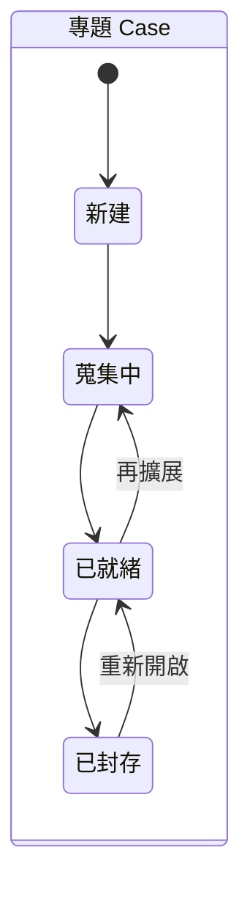
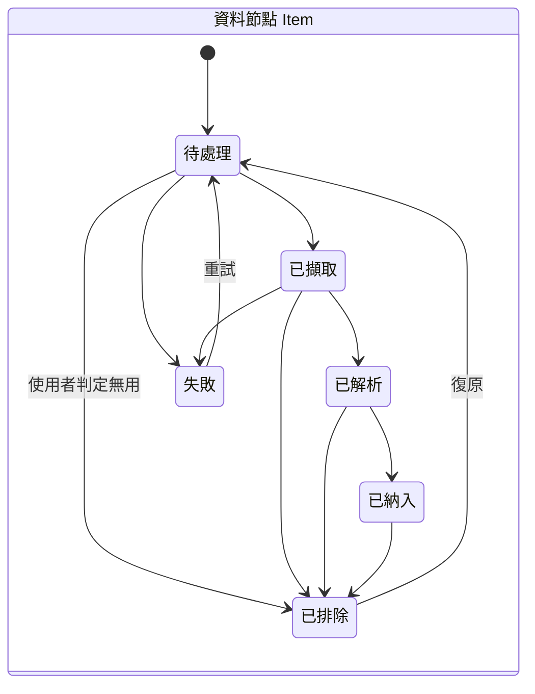
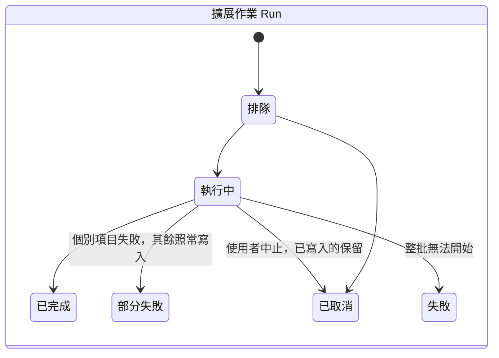
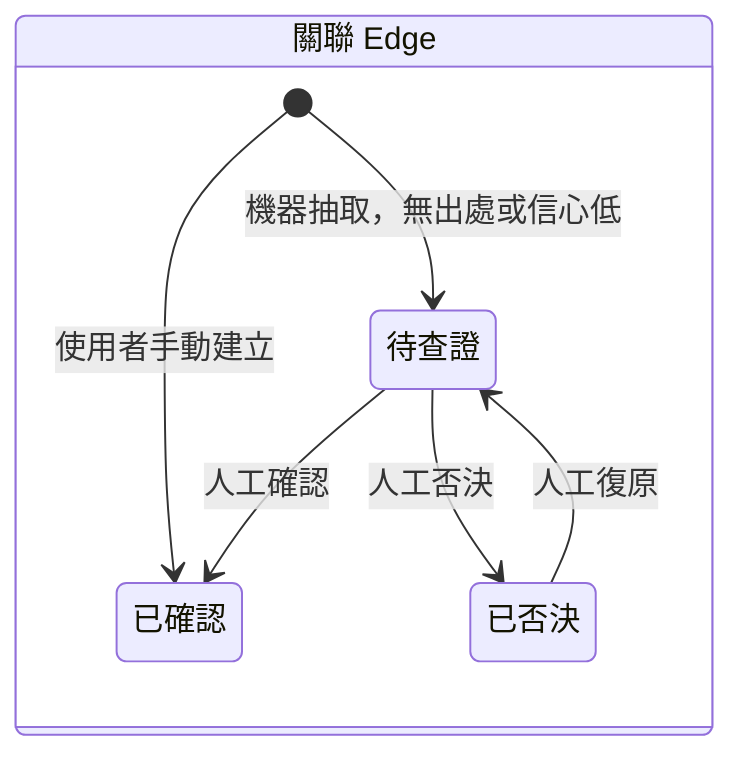

# 狀態機

**這份是每個狀態機「從 A 能不能到 B」的權威。** 觸發轉移的 UI 在哪一頁寫在
`ui-workflows.md`（尚未撰寫），不要在這裡重複。

> **圖是導覽，不是規格。** 下面每一節的**轉移表**才是權威 —— 圖回答不了
> 「從 A 能不能到 B」這個問題，但表可以。

> **現況：設計，尚未實作。** 2026-09-05 這個 repo 裡一行程式都沒有。

---

## 專題 Case

| 從 | 到 | 什麼時候 |
|---|---|---|
| （初始）| 新建 | 使用者建立專題 |
| 新建 | 蒐集中 | 第一次擴展或匯入開始 |
| 蒐集中 | 已就緒 | 該批作業全部結束（含部分失敗）|
| 已就緒 | 蒐集中 | 再擴展 |
| 已就緒 | 已封存 | 使用者封存 |
| 已封存 | 已就緒 | 重新開啟 |

**沒有「刪除」狀態** —— 刪除就是刪除，不留狀態。

## 資料節點 Item

| 從 | 到 | 什麼時候 |
|---|---|---|
| （初始）| 待處理 | 進入佇列 |
| 待處理 | 已擷取 | snapshot 寫好、雜湊算完 |
| 已擷取 | 已解析 | 正文抽出、語言判定、信心值記錄 |
| 已解析 | 已納入 | 進到圖裡 |
| 任何一個 | 已排除 | **使用者**判定無用 |
| 已排除 | 待處理 | 使用者復原 |
| 待處理／已擷取 | 失敗 | 該階段出錯 |
| 失敗 | 待處理 | 重試 |

**「已排除」只由人設定，機器不會自己排除任何東西。**

## 擴展作業 Run

| 從 | 到 | 什麼時候 |
|---|---|---|
| 排隊 | 執行中 | 排到它 |
| 執行中 | 已完成 | 全部項目成功 |
| 執行中 | **部分失敗** | 個別項目失敗，**其餘照常寫入** |
| 執行中 | 已取消 | 使用者中止 —— **已寫入的保留** |
| 執行中 | 失敗 | 整批無法開始（例如 provider 配不上）|
| 排隊 | 已取消 | 還沒開始就取消 |

> **`部分失敗` 是一等公民，不是「失敗」的一種。**
> 一批 40 個 URL 有 3 個 404，其餘 37 個的內容不該跟著消失。
> 把它併進「失敗」是最容易犯、也最傷的簡化。

## 關聯 Edge

| 從 | 到 | 誰 |
|---|---|---|
| （初始）| 待查證 | 機器抽取 |
| （初始）| 已確認 | **使用者手動建立** |
| 待查證 | 已確認 | 人工 |
| 待查證 | 已否決 | 人工 |
| 已否決 | 待查證 | 人工復原 |

**沒有任何一條轉移的執行者是機器。**

> ### 這個狀態機是整個工具的地基
>
> **機器永遠不得覆寫人工判定。重跑擴展只新增，不推翻。**
>
> 違反的話會發生什麼：使用者花時間確認過的關聯，在下一次擴展之後變回「待查證」
> 或消失。那件事發生一次，之後就沒有人願意再做確認 —— 而人工裁決正是這個工具
> 跟「一鍵生成關聯圖」的全部差別。
>
> 對應的實作約束：`edge` 的 `origin` 欄位（`machine`／`human`）與 `status` 分開存，
> 寫入路徑對 `origin='human'` 的列只能新增不能改。

## 兩個狀態機之間的關係

**`Edge` 的 `已確認` 需要至少一筆 `edge_evidence`** —— 除非 `origin='human'`
（人手動建立的關聯，出處就是那個人）。這條約束寫在 `data-model.md`，
由資料庫層的檢查守著，不是靠 UI 記得。
